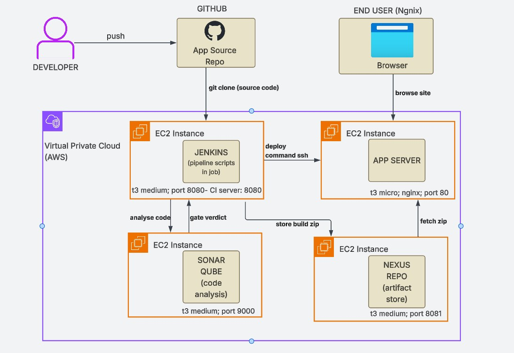
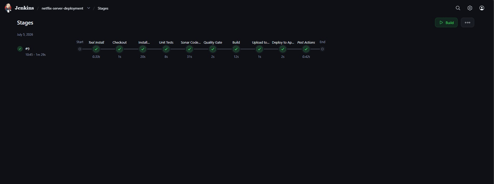
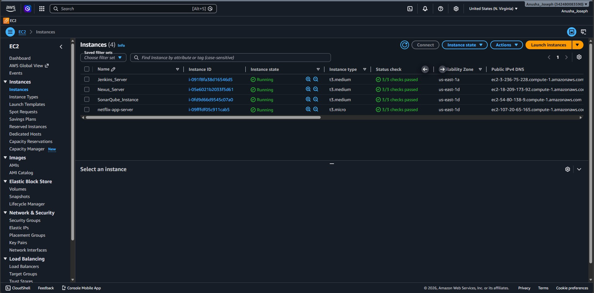
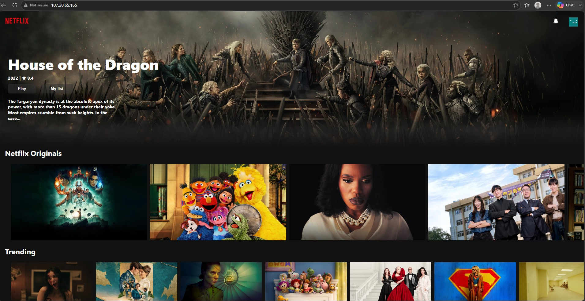

# Netflix Clone - CI/CD Pipeline on AWS

End-to-end CI/CD pipeline built from scratch on AWS using Jenkins, SonarQube, Nexus and nginx. Every build is tested, quality-gated, versioned, and deployed to a live server.

## How it works

1. Developer pushes code to GitHub
2. Jenkins clones the source (Checkout stage)
3. Jenkins sends the code to SonarQube for static analysis
4. SonarQube returns the quality gate verdict via webhook
5. Jenkins zips the production build and stores it in Nexus, versioned per build
6. Jenkins sends the deploy command to the app server over SSH
7. The app server fetches the artifact from Nexus
8. End users browse the live site over HTTP

## AWS Infrastructure

- **Jenkins server** - EC2 t3.medium, port 8080. Runs Jenkins on Java 21, with the NodeJS 16 toolchain, sonar-scanner, and zip.
- **SonarQube server** - EC2 t3.medium, port 9000. Runs SonarQube on Java 21 with a PostgreSQL backing database.
- **Nexus server** - EC2 t3.medium, port 8081. Runs Nexus 3 on Java 17 with a raw hosted repository for build artifacts.
- **App server** - EC2 t3.micro, port 80 (public). Runs nginx and unzip only, since the artifact is pre-built static content.

All server-to-server traffic uses private IPs with security-group-to-security-group rules: Jenkins to SonarQube on 9000, SonarQube to Jenkins on 8080 for the webhook, Jenkins to Nexus on 8081, app server to Nexus on 8081, and Jenkins to the app server on 22. Only the app server's port 80 is open to the internet.

## Pipeline stages

1. **Checkout** – Jenkins downloads the latest code from GitHub
2. **Install Dependencies** – downloads all the libraries the app needs (npm install)
3. **Unit Tests** – runs automated tests; if any test fails, the pipeline stops here
4. **Sonar Code Analysis** – SonarQube scans the code for bugs, security issues, and bad practices
5. **Quality Gate** – SonarQube gives a pass or fail verdict; a fail stops the pipeline
6. **Build** – compiles the app into production-ready files, with the API key added securely from Jenkins credentials
7. **Upload to Nexus** – the built app is zipped, given a version number, and stored in Nexus
8. **Deploy** – the app server downloads the zip from Nexus and puts it live on the website

Deploys always come from the artifact store, never from the build workspace, so any stored version can be redeployed. Rolling back means deploying an older zip.

Pipeline-as-a-code is inside the Jenkinsfile.

## Setup notes

**Application** 
-Cloned a React and TMDB based Netflix clone. The upstream repository had its TMDB API key hardcoded and publicly exposed, so the key was moved to an environment variable, the .env file was gitignored, and the key is supplied by Jenkins credentials in CI.

**Jenkins**
- Installed via a user data script on instance launch, following Jenkins's official Linux install documentation - Java runtime, Jenkins's apt repository key and source, and the Jenkins package itself, with the service enabled to start automatically on boot.
- Ubuntu 24.04 with Java 21, which Jenkins 2.543 and later requires; the repository was added using the current `jenkins.io-2026` signing key.
- Plugins used: NodeJS, SonarQube Scanner, and SSH Agent.
- All secrets (SSH credentials, SonarQube token) live in the Jenkins credentials store and are masked in build logs.

**SonarQube**
- Installed via a user data script on instance launch - a dedicated non-root service user, PostgreSQL as the backing store, a systemd unit configured per SonarQube's official documentation, token authentication, and a webhook pointing at Jenkins's private IP.

**Nexus**
- Installed via a user data script on instance launch, following Sonatype's official install documentation - a versioned download, a dedicated nexus service user, a systemd unit, and a raw hosted repository for the zip artifacts.

**App server** 
-nginx and unzip only.

Provisioning scripts for all four instances are in the infra folder.

## AWS Instances

## Future work

- Zero-downtime deploys
- Terraform and Ansible to replace user-data provisioning

## Live Website

## Key takeaways

- **Pipeline as code** - the entire build, test, and deploy process is defined in a
  Jenkinsfile stored in this repository, not clicked together in a UI
- **Quality is enforced** - a failing unit test or a failed SonarQube
  quality gate stops the pipeline before anything is built or deployed
- **Artifacts are versioned and immutable** - every build produces a numbered zip in
  Nexus; deploys always come from the artifact store, so any version can be redeployed
  and rollback is just deploying an older build
- **Secrets never touch the code** - the API key, Nexus credentials, and SSH keys all
  live in the Jenkins credentials store and are injected at runtime, masked in logs
- **Infrastructure is documented and reproducible** - every server was built from a
  provisioning script kept in this repo; the servers are disposable, the repo is the
  source of truth
- **Networks are locked down by identity** - services talk over private IPs with
  security-group-to-security-group rules; only the app server's port 80 faces the internet

## What this mirrors in a real-time work

- **The workflow**: developer pushes code, automation takes over, and a tested,
  scanned, versioned release reaches a server with no manual steps in between -
  the same shape as production delivery pipelines at any software company
- **The toolchain**: Jenkins, SonarQube, and Nexus (or their equivalents like GitHub
  Actions, and Artifactory) are the standard enterprise CI/CD stack
- **The separation of concerns**: a build server, a quality server, an artifact store,
  and a deploy target as independent services - how real platforms are structured,
  rather than one machine doing everything
- **The operational reality**: version requirements, download
  endpoints moving, memory pressure, firewall rules, and credential management

## Credits

UI based on a React and TMDB Netflix clone by vishnusatheeshpulickal. This project is the CI/CD pipeline, infrastructure, and automation built around it.
